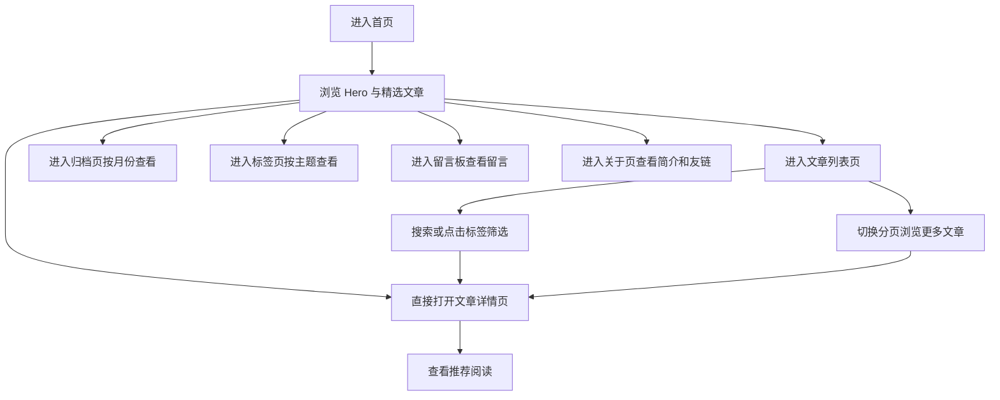

## 1. 产品概述
将现有 Vue3 + Vite 项目重构为一个纯前端静态个人博客站点，强调欧美极简审美、沉浸式阅读体验与高完成度交互动效。
- 面向个人品牌展示、文章发布、归档浏览与访客互动场景，适合零后端部署到 GitHub Pages 等静态托管平台。
- 通过高质量视觉风格、完整内容结构与轻量交互，提升站点辨识度、阅读停留时间与可维护性。

## 2. 核心功能

### 2.1 功能模块
1. **首页**：动态渐变 Hero、精选文章卡片、最新发布列表、站点数据计数器。
2. **文章列表页**：文章网格、关键词搜索、推荐文章、标签云、分页器。
3. **文章详情页**：沉浸式阅读布局、代码块、引用、多级标题、推荐阅读。
4. **日历归档页**：按月份浏览文章、日历视图高亮、有文章日期提示。
5. **标签分类页**：交互式标签云、标签筛选、相关文章列表。
6. **留言板页**：留言引导、模拟留言列表、提交表单、手动维护说明。
7. **关于/友链页**：个人简介、站点统计、技能摘要、友情链接卡片。

### 2.2 页面详情
| 页面名称 | 模块名称 | 功能描述 |
|-----------|-------------|---------------------|
| 首页 | 顶部导航 | 提供站点主导航，滚动后显示毛玻璃背景与边框阴影 |
| 首页 | Hero 区域 | 展示博客定位、个人介绍、主行动按钮、动态渐变背景 |
| 首页 | 精选文章 | 使用卡片形式展示重点内容，支持悬停抬升与阴影变化 |
| 首页 | 最新发布 | 以时间顺序列出新文章，帮助快速进入详情页 |
| 首页 | 数据统计 | 通过数字计数动画展示文章数、标签数、阅读时长等 |
| 文章列表页 | 搜索栏 | 在前端静态数据中按标题、摘要、标签进行即时筛选 |
| 文章列表页 | 推荐文章 | 展示优先级更高或置顶的内容卡片 |
| 文章列表页 | 标签云 | 展示全部标签，支持 hover 缩放与点击过滤 |
| 文章列表页 | 分页器 | 在纯前端数据集中按页展示文章列表 |
| 文章详情页 | 阅读正文 | 提供 Markdown 风格排版，包括段落、标题、引用和代码块 |
| 文章详情页 | 文章信息栏 | 展示发布时间、阅读时长、标签与返回入口 |
| 文章详情页 | 推荐阅读 | 根据标签或主题关联展示其他文章 |
| 日历归档页 | 月份切换 | 通过前端状态切换不同月份的归档视图 |
| 日历归档页 | 日历网格 | 高亮包含文章的日期并展示当日文章摘要 |
| 标签分类页 | 标签云筛选 | 点击标签后即时筛选相关文章并更新激活状态 |
| 留言板页 | 留言引导 | 说明该站点为静态博客、留言内容需要手动维护 |
| 留言板页 | 模拟留言 | 展示预置留言卡片，营造社区感 |
| 留言板页 | 提交表单 | 统一风格的静态表单，仅作界面展示和输入反馈 |
| 关于/友链页 | 个人简介 | 展示站点作者、创作方向、工作方式与联系方式 |
| 关于/友链页 | 站点数据 | 展示累计文章数、标签数、上线时间等指标 |
| 关于/友链页 | 友情链接 | 以卡片形式展示推荐站点或朋友链接 |

## 3. 核心流程
访客进入首页后可浏览博客定位、精选内容与站点数据，并通过导航进入文章列表、归档、标签页等二级页面。用户可在文章列表页通过搜索、标签与分页筛选内容，在详情页沉浸式阅读文章，并继续浏览相关推荐。留言板与关于页分别承担互动引导和个人品牌展示功能，全流程均为前端静态渲染，不依赖数据库或后端接口。

## 4. 用户界面设计
### 4.1 设计风格
- 主色调：米白 `#f6f1e8`、浅灰 `#d8d4cb`、纸白 `#fbf8f3`
- 点缀色：墨绿 `#1f4d3c`、深墨绿 `#17362b`
- 文字颜色：炭黑 `#171717`、次级灰 `#5f625d`
- 按钮风格：细边框、圆角胶囊按钮、低饱和填充色
- 字体方案：标题与 UI 使用 Inter，正文使用系统无衬线备用字体
- 布局风格：大留白、编辑部式分栏、卡片与内容区块结合
- 图标风格：使用 Font Awesome 线性图标，视觉统一克制
- 动效风格：柔和淡入、轻微上浮、模糊过渡与渐进式 reveal

### 4.2 页面设计概览
| 页面名称 | 模块名称 | UI 元素 |
|-----------|-------------|-------------|
| 首页 | Hero 区域 | 大面积渐变背景、超大标题、说明文案、主次按钮、柔和光斑 |
| 首页 | 精选文章 | 米白卡片、细边框、悬停抬升、阴影增强、信息层次清晰 |
| 首页 | 数据统计 | 大号数字、滚动计数动画、分隔排版、低对比背景块 |
| 文章列表页 | 主内容区 | 响应式卡片网格、摘要信息、分页器、悬停态联动 |
| 文章列表页 | 侧边栏 | 搜索框、推荐卡片、标签云、吸顶区块 |
| 文章详情页 | 正文阅读 | 窄栏排版、舒适行高、引用条、代码块深色主题 |
| 日历归档页 | 日历视图 | 月份切换器、规则网格、文章日期高亮、说明面板 |
| 标签分类页 | 标签云 | 大小不一标签、hover 缩放、激活态墨绿高亮 |
| 留言板页 | 表单区 | 极简输入框、浅边框、柔和阴影、说明文案 |
| 关于/友链页 | 简介与友链 | 双栏布局、数据统计卡片、友链卡片、社交入口 |

### 4.3 响应式设计
- 采用桌面优先设计，1440px 宽屏下保持强留白和清晰分栏。
- 在平板尺寸下切换为单列主内容 + 顺序侧边栏布局。
- 在移动端收缩导航、卡片、日历网格与统计模块，保证点击区域和阅读舒适度。
- 所有动画在移动端保持轻量化，避免过度位移导致性能和可读性下降。
