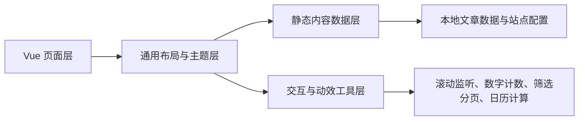
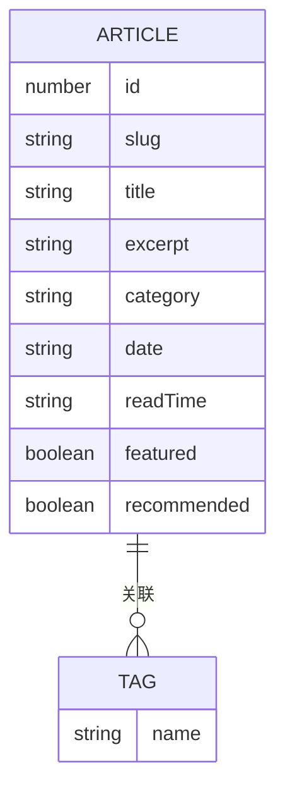

## 1. 架构设计


## 2. 技术描述
- 前端：Vue 3.5 + Vue Router 4 + Vite 5
- 样式：原生 CSS + CSS 变量 + 少量原子化工具类命名
- 图标：Font Awesome CDN
- 数据：本地静态 JavaScript 模块维护文章、标签、留言、友链和站点配置
- 交互：原生浏览器 API 实现 Scroll Reveal、计数动画、分页、搜索、筛选和归档逻辑
- 部署：纯静态资源构建，可直接部署到 GitHub Pages 或任意静态服务器

## 3. 路由定义
| 路由 | 用途 |
|-------|---------|
| / | 博客首页，展示 Hero、精选文章、最新发布和站点统计 |
| /articles | 文章列表页，提供搜索、推荐、标签云与分页 |
| /article/:slug | 文章详情页，展示正文、代码块、引用与推荐阅读 |
| /archive | 日历归档页，按月份浏览文章 |
| /tags | 标签分类页，按标签筛选文章 |
| /guestbook | 留言板页，展示模拟留言和静态表单 |
| /about | 关于与友链页，展示作者简介、站点数据与友情链接 |

## 4. API 定义
项目不接入后端接口，所有内容由本地静态数据模块提供。

```ts
type Article = {
  id: number
  slug: string
  title: string
  excerpt: string
  content: Array<{ type: string; value?: string; code?: string; language?: string }>
  cover: string
  category: string
  tags: string[]
  date: string
  readTime: string
  featured: boolean
  recommended: boolean
}

type SiteStat = {
  label: string
  value: number
  suffix?: string
}

type GuestbookEntry = {
  id: number
  name: string
  date: string
  content: string
}

type FriendLink = {
  name: string
  description: string
  href: string
}
```

## 5. 数据模型
### 5.1 数据模型定义


### 5.2 数据说明
- `src/data/site.js`：站点标题、简介、导航、统计数据、社交链接
- `src/data/articles.js`：文章列表、文章详情内容、归档辅助字段、推荐标记
- `src/data/guestbook.js`：模拟留言与表单提示文案
- `src/data/friends.js`：友情链接与推荐说明
- `src/utils/blog.js`：搜索、分页、归档月份、标签统计、相关推荐等纯函数

## 6. 组件与页面拆分
- `App.vue`：站点壳层，承载路由与全局背景
- `src/components/blog/BlogHeader.vue`：桌面与移动导航、滚动毛玻璃状态
- `src/components/blog/BlogFooter.vue`：页脚信息
- `src/components/blog/HeroBanner.vue`：首页 Hero 动态背景与主按钮
- `src/components/blog/ArticleCard.vue`：文章卡片，可用于首页和列表页
- `src/components/blog/RevealSection.vue`：滚动显现容器
- `src/components/blog/CounterStat.vue`：数字滚动动画组件
- `src/components/blog/TagCloud.vue`：标签云和 hover 缩放
- `src/components/blog/PaginationBar.vue`：分页器
- `src/components/blog/CalendarArchive.vue`：日历归档网格

## 7. 关键交互实现策略
- 页面加载淡入：在根容器和首屏区块添加初始化 class，通过 CSS keyframes 实现 staged fade-in。
- Scroll Reveal：使用 `IntersectionObserver` 监听带有 reveal 标记的元素进入视口后添加显现 class。
- 导航毛玻璃：监听滚动距离，在头部切换 `is-scrolled` 状态类并启用 `backdrop-filter`。
- 动态 Hero：通过多层 radial-gradient 与动画 keyframes 组合实现墨绿调渐变流动。
- 卡片悬停：使用 `transform: translateY()` 和增强阴影实现轻微抬升。
- 标签云：hover 时增加缩放与颜色反差，点击时切换 active 标签并刷新列表。
- 数字计数：在元素进入视口后使用 `requestAnimationFrame` 做数值补间。

## 8. 性能与可维护性
- 所有页面共享统一主题变量、容器宽度和动效节奏，减少重复样式。
- 文章数据、站点配置与工具函数独立，便于后续手动维护和扩展。
- 减少依赖，仅保留现有 Vue 生态；图标通过 CDN 引入，不增加 npm 包体积。
- 页面采用懒加载路由，保障首屏性能与构建体积。
