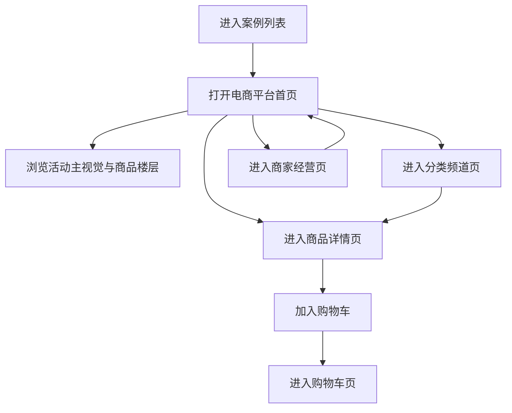

## 1. 产品概述
打造一个覆盖综合电商、垂直电商、跨境电商、团购秒杀与 B2B 批发场景的电商购物平台案例站点，以高仿真电商首页、商品详情、购物车与商家经营页面呈现完整交易体验。
- 面向消费者、企业采购与商家三类核心角色，展示从商品浏览、活动促销、下单支付到商家经营的关键流程。
- 通过接近主流电商平台的界面风格与信息架构，体现商品运营、活动营销、履约服务与平台经营能力。

## 2. 核心功能

### 2.1 用户角色
| 角色 | 进入方式 | 核心权限 |
|------|----------|----------|
| 个人消费者 | 直接访问站点 | 浏览商品、查看活动、加入购物车、模拟下单 |
| 企业采购人员 | 进入采购专区 | 查看批量采购与账期能力、浏览 B2B 商品方案 |
| 商家 / 品牌方 | 进入商家中心 | 查看经营看板、商品管理、营销工具与订单概览 |

### 2.2 功能模块
1. **电商首页**：频道导航、主视觉大促、楼层化商品推荐、秒杀区、跨境专区、品牌馆、猜你喜欢。
2. **分类频道页**：综合品类、垂直行业楼层、筛选导航、活动专题与榜单推荐。
3. **商品详情页**：商品图文、规格选择、价格权益、服务保障、评价、推荐搭配。
4. **购物车页**：跨店铺商品、优惠提示、凑单推荐、金额汇总与结算区。
5. **商家经营页**：经营数据、订单统计、营销工具、热销商品与履约状态。

### 2.3 页面详情
| 页面名称 | 模块名称 | 功能描述 |
|-----------|-------------|---------------------|
| 电商首页 | 顶部导航与搜索 | 展示全站频道入口、搜索框、购物车、用户权益入口 |
| 电商首页 | 大促主视觉 | 展示平台主促销活动、优惠信息、品牌露出和跳转 CTA |
| 电商首页 | 秒杀专区 | 展示倒计时、限时价格、库存紧张感与活动入口 |
| 电商首页 | 楼层推荐 | 展示综合电商、跨境、美妆、生鲜、数码等多品类商品楼层 |
| 电商首页 | 品牌馆 / 海外购 | 展示品牌集合、保税仓、直邮、正品溯源等跨境能力 |
| 分类频道页 | 分类导航 | 展示一级品类、筛选快捷入口和专题推荐 |
| 分类频道页 | 商品瀑布流 | 展示频道重点商品、价格、标签和权益信息 |
| 商品详情页 | 商品主信息 | 展示主图、视频、价格、活动、规格、服务承诺 |
| 商品详情页 | 权益与评价 | 展示会员价、优惠券、物流时效、售后与用户评价 |
| 购物车页 | 购物车列表 | 展示跨店铺商品、优惠、满减提示与删除操作 |
| 购物车页 | 结算区 | 展示合计金额、已优惠金额和结算按钮 |
| 商家经营页 | 数据看板 | 展示 GMV、订单量、复购率、履约率等核心经营指标 |
| 商家经营页 | 商品与营销 | 展示热销商品、秒杀活动、优惠券与订单处理队列 |

## 3. 核心流程
用户从案例列表进入电商购物平台案例首页后，浏览首页活动和推荐商品，可继续进入分类频道页查看垂直品类内容，进入商品详情页了解价格、规格和服务信息，再前往购物车页查看结算逻辑；同时可切换到商家经营页查看平台经营与营销能力，从而完整理解电商平台的消费端与商家端体验。

## 4. 用户界面设计
### 4.1 设计风格
- 主色调：电商红 `#e1251b`、深色文字 `#222`
- 辅助色：橙金 `#ffb347`、浅灰背景 `#f5f5f5`、白色卡片 `#ffffff`
- 按钮风格：高饱和实心按钮、圆角适中、强促销 CTA
- 字体规范：标题强调粗体无衬线，价格数字高对比放大，正文使用系统无衬线字体
- 布局风格：楼层化运营、双栏与多栏商品卡组合、搜索头部固定、电商平台式密集布局
- 图标风格：简洁线性图标搭配电商标签、促销角标、会员标识
- 动效风格：悬停抬升、价格高亮、活动卡微动效、楼层切换流畅

### 4.2 页面设计概览
| 页面名称 | 模块名称 | UI 元素 |
|-----------|-------------|-------------|
| 电商首页 | 搜索头部 | 品牌 logo、搜索框、购物车、频道导航、会员入口 |
| 电商首页 | 活动首屏 | 红色大促背景、主 Banner、优惠文案、活动入口 |
| 电商首页 | 商品楼层 | 商品卡、价格、活动标签、销量、保障标识 |
| 分类频道页 | 分类头图 | 频道名、筛选按钮、专题 banner、快捷标签 |
| 商品详情页 | 商品信息区 | 商品图、价格、促销权益、规格、服务标签、购买按钮 |
| 购物车页 | 结算布局 | 左侧商品列表、右侧金额汇总与结算信息 |
| 商家经营页 | 工作台 | 顶部指标卡、订单列表、营销活动区、商品排行 |

### 4.3 响应式设计
- 采用桌面优先设计，优先还原主流电商 PC 站首页与详情页体验。
- 平板端压缩多列商品楼层为双列布局，保留主要促销与商品信息。
- 移动端聚焦商品卡、价格与 CTA，频道导航转为横向滑动。
