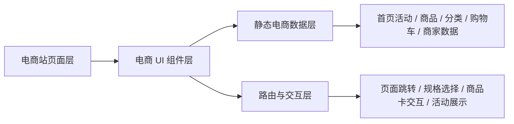
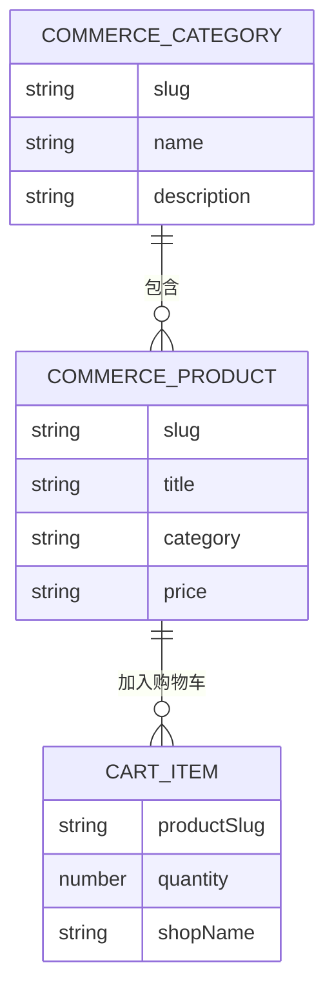

## 1. 架构设计


## 2. 技术描述
- 前端：Vue 3.5 + Vue Router 4 + Vite 5
- 样式：原生 CSS + 组件化页面样式
- 数据：本地静态 JavaScript 模块维护活动、商品、分类、购物车与商家经营数据
- 交互：基于 Vue 计算属性和路由参数实现商品详情、频道跳转和购物车展示
- 部署：纯静态构建，可直接部署到 GitHub Pages 或其他静态托管平台

## 3. 路由定义
| 路由 | 用途 |
|-------|---------|
| /commerce/home.html | 电商平台首页，作为案例主入口 |
| /commerce/category/:slug.html | 电商分类频道页 |
| /commerce/product/:slug.html | 商品详情页 |
| /commerce/cart.html | 购物车页 |
| /commerce/seller.html | 商家经营页 |
| /cases.html | 案例列表页，展示电商案例入口 |

## 4. API 定义
项目不接入后端接口，所有内容由本地静态数据模块提供。

```ts
type CommerceCategory = {
  slug: string
  name: string
  description: string
}

type CommerceProduct = {
  slug: string
  title: string
  category: string
  price: string
  originalPrice?: string
  tags: string[]
  seller: string
  summary: string
}

type CommerceCartItem = {
  productSlug: string
  quantity: number
  shopName: string
}
```

## 5. 数据模型
### 5.1 数据模型定义


## 6. 数据说明
- `src/data/commerceSite.js`：维护电商站活动、商品、频道、购物车和商家数据
- `src/components/commerce/`：维护电商站头部、布局、商品卡等复用组件
- `src/views/commerce/`：维护电商站首页、频道、详情、购物车、商家页
- `src/router/index.js`：注册电商站相关路由

## 7. 组件与页面拆分
- `src/views/commerce/home.vue`：电商首页
- `src/views/commerce/category.vue`：分类频道页
- `src/views/commerce/product.vue`：商品详情页
- `src/views/commerce/cart.vue`：购物车页
- `src/views/commerce/seller.vue`：商家经营页
- `src/components/commerce/CommerceHeader.vue`：电商站头部
- `src/components/commerce/CommerceLayout.vue`：电商站统一布局
- `src/components/commerce/CommerceProductCard.vue`：通用商品卡片

## 8. 关键交互实现策略
- 首页作为案例入口，直接承接平台活动、楼层化商品和跨境/秒杀能力展示
- 商品详情与频道页通过静态路由参数联动同一份商品数据
- 购物车页通过静态购物车数据模拟跨店铺结算布局
- 商家经营页采用经营中台式布局，强化平台经营能力展示
- 视觉风格参考主流综合电商 PC 站与内容化电商平台，强调价格、活动和楼层运营

## 9. 性能与可维护性
- 通过独立 `commerce` 目录隔离电商案例与资讯站、博客站
- 商品卡、头部与布局组件可复用，方便后续扩展更多电商子页面
- 保持纯前端静态实现，便于展示与部署
