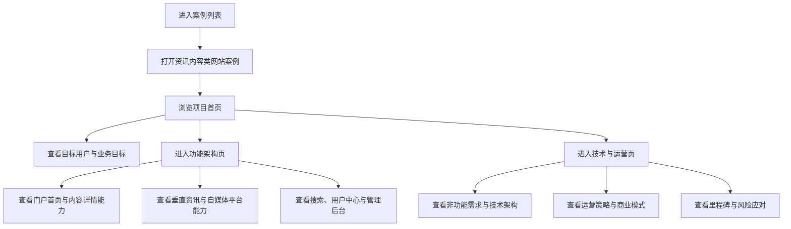

## 1. 产品概述
打造一个资讯内容类网站案例站点，以“综合门户 / 垂直资讯 / 自媒体博客”三类业务形态为核心，展示完整的信息分发、创作者生态与商业化设计能力。
- 面向项目展示、案例沉淀与客户沟通场景，将长篇需求文档转化为高完成度的前端网站案例。
- 通过结构化页面、鲜明视觉和可浏览的信息架构，体现产品规划、功能体系与平台价值。

## 2. 核心功能

### 2.1 功能模块
1. **项目首页**：项目定位、核心价值、目标用户、业务目标、关键数据展示。
2. **功能架构页**：门户首页、内容详情、垂直资讯、自媒体平台、搜索、用户中心、管理后台等模块化说明。
3. **技术与运营页**：非功能需求、技术架构、内容运营、商业模式、风险与里程碑展示。

### 2.2 页面详情
| 页面名称 | 模块名称 | 功能描述 |
|-----------|-------------|---------------------|
| 项目首页 | Hero 首屏 | 展示项目标题、定位描述、版本信息、核心价值和主行动按钮 |
| 项目首页 | 关键指标 | 展示 DAU、频道数、内容量、创作者规模等业务目标 |
| 项目首页 | 用户角色 | 展示资讯消费者、深度阅读用户、创作者、广告方四类目标用户 |
| 项目首页 | 核心能力总览 | 快速概览内容分发、创作者生态、搜索、商业化、后台治理能力 |
| 功能架构页 | 门户首页模块 | 展示多频道导航、热点聚合、个性化推荐、Banner、快讯 |
| 功能架构页 | 内容详情页 | 展示正文能力、评论互动、分享、收藏、阅读模式 |
| 功能架构页 | 垂直资讯子站 | 展示子站架构、图表数据、专家专栏、报告库 |
| 功能架构页 | 自媒体平台 | 展示创作者工作台、数据看板、粉丝管理、收益中心、原创保护 |
| 功能架构页 | 搜索与用户中心 | 展示全局搜索、搜索建议、账号体系、消息中心、积分等级 |
| 功能架构页 | 管理后台 | 展示内容审核、推荐配置、用户管理、广告管理、数据大盘 |
| 技术与运营页 | 非功能需求 | 展示性能、可靠性、安全、兼容性需求 |
| 技术与运营页 | 技术架构 | 展示前端、后端、数据库、缓存、推荐引擎、消息队列建议 |
| 技术与运营页 | 内容运营 | 展示内容来源、审核机制、推荐策略、创作者激励和版权管理 |
| 技术与运营页 | 商业模式 | 展示信息流广告、内容付费、创作者分成、品牌合作 |
| 技术与运营页 | 里程碑计划 | 展示四阶段交付周期与验收目标 |
| 技术与运营页 | 风险与应对 | 展示合规、版权、稳定性和增长风险及预案 |

## 3. 核心流程
用户从案例列表进入该资讯内容类网站案例后，首先在项目首页理解产品定位、用户对象和业务目标，再继续浏览功能架构页了解完整能力模块，最后在技术与运营页查看非功能、架构、商业化和里程碑内容，形成对项目全貌的系统认知。

## 4. 用户界面设计
### 4.1 设计风格
- 主色调：深蓝 `#071734`、蓝黑 `#172033`
- 辅助色：青绿 `#18a787`、高亮青色 `#41d9b0`
- 背景体系：大面积浅灰白与深色沉浸区块交替，形成内容层次
- 按钮风格：圆角胶囊按钮、细边框、深浅双风格主次按钮
- 字体方案：标题采用高识别度衬线或杂志风展示字体，正文采用清晰现代无衬线字体
- 布局风格：编辑式长页面、信息卡片、模块分段、强节奏留白
- 图标风格：简洁线性图标，配合数据卡片和模块说明
- 动效风格：分段 reveal、卡片 hover、数字滚动、页面内渐进式层次呈现

### 4.2 页面设计概览
| 页面名称 | 模块名称 | UI 元素 |
|-----------|-------------|-------------|
| 项目首页 | Hero 首屏 | 深色渐变背景、大标题、副标题、项目标签、主操作按钮、装饰光效 |
| 项目首页 | 目标用户区 | 四列用户卡片、角色标签、场景描述 |
| 项目首页 | 业务目标区 | 高亮数据卡片、简短指标说明、深浅对比布局 |
| 功能架构页 | 模块导航区 | 吸顶分段导航、模块锚点、卡片式目录 |
| 功能架构页 | 功能模块卡片 | 模块标题、摘要、功能点列表、标签型能力点 |
| 技术与运营页 | 架构展示区 | 分栏信息卡片、架构说明、技术栈标签、流程列表 |
| 技术与运营页 | 里程碑区 | 时间轴、阶段卡片、周期与验收标准 |
| 全站 | 过渡与动效 | 淡入上浮、按钮悬停、卡片轻抬升、分区滚动显现 |

### 4.3 响应式设计
- 采用桌面优先设计，桌面端突出编辑式排版、双列信息布局与分段节奏。
- 平板端将多列模块收敛为双列或单列，保持阅读连贯性。
- 手机端采用单列流式布局，缩小标题层级与卡片密度，确保长页面浏览舒适。
- 顶部导航与模块跳转在移动端需要收纳为紧凑布局，保证触控可用性。
