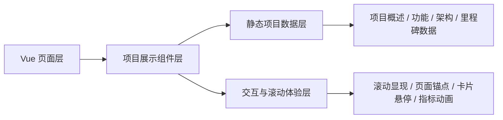
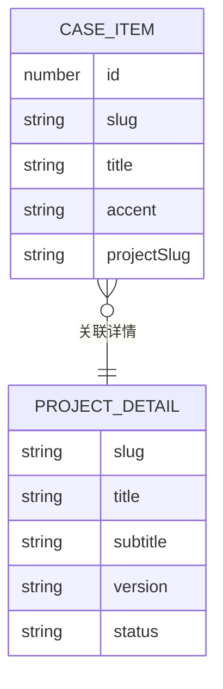

## 1. 架构设计


## 2. 技术描述
- 前端：Vue 3.5 + Vue Router 4 + Vite 5
- 初始化基础：沿用现有 Vue + Vite 项目结构
- 样式：原生 CSS + CSS 变量 + 模块化页面样式
- 数据：本地静态 JavaScript 模块维护案例数据与项目详情数据
- 交互：使用原生浏览器 API 实现滚动显现、锚点跳转和轻交互动效
- 部署：纯静态构建，可直接部署到 GitHub Pages 或其他静态托管平台

## 3. 路由定义
| 路由 | 用途 |
|-------|---------|
| /home.html | 站点首页，展示博客首页与精选案例入口 |
| /cases.html | 案例列表页，展示全部案例卡片 |
| /project/news-content-platform.html | 资讯内容类网站项目首页，展示项目案例详情 |

## 4. API 定义
项目不接入后端接口，所有内容由本地静态数据模块提供。

```ts
type CaseItem = {
  id: number
  slug: string
  title: string
  highlights: string[]
  accent: string
  projectSlug?: string
}

type ProjectDetail = {
  slug: string
  title: string
  subtitle: string
  version: string
  date: string
  status: string
  author: string
  summary: string
  overview: string[]
  targetUsers: string[]
  businessGoals: string[]
  functionalSections: Array<{
    title: string
    items: string[]
  }>
  nonFunctional: string[]
  designRequirements: string[]
  architecture: string[]
  operations: string[]
  monetization: string[]
  milestones: Array<{
    phase: string
    deliverable: string
    period: string
    acceptance: string
  }>
  risks: string[]
}
```

## 5. 数据模型
### 5.1 数据模型定义


### 5.2 数据说明
- `src/data/cases.js`：维护案例列表基础信息与详情页关联字段
- `src/data/projects.js`：维护项目级详情数据，包括 PRD、架构、运营、里程碑等内容
- `src/views/cases/index.vue`：案例列表页
- `src/views/project/index.vue`：项目详情展示页
- `src/views/home/index.vue`：首页精选案例展示与跳转入口

## 6. 组件与页面拆分
- `src/views/cases/index.vue`：案例列表展示，保持简洁卡片样式并支持详情跳转
- `src/views/project/index.vue`：项目详情承载页，负责渲染长篇项目内容
- `src/components/blog/RevealSection.vue`：项目页面分段滚动显现
- `src/router/index.js`：项目详情路由注册

## 7. 关键交互实现策略
- 案例跳转：案例列表与首页精选案例通过 `projectSlug` 关联到项目详情页
- 长页阅读：使用分段卡片和区块容器降低长文档阅读压力
- 滚动显现：项目区块进入视口后渐显，提升页面节奏感
- 卡片反馈：案例卡片和功能模块卡片提供 hover 抬升和边框变化
- 页面结构：通过 Hero、模块区、时间轴和双列内容组合提升展示感

## 8. 性能与可维护性
- 项目详情采用静态数据驱动，后续可继续扩展更多案例项目而不改核心结构
- 视觉风格与现有站点主题保持一致，降低维护成本
- 新增页面和数据模块与博客内容分离，避免互相污染
- 保持纯前端静态方案，不引入额外后端复杂度
