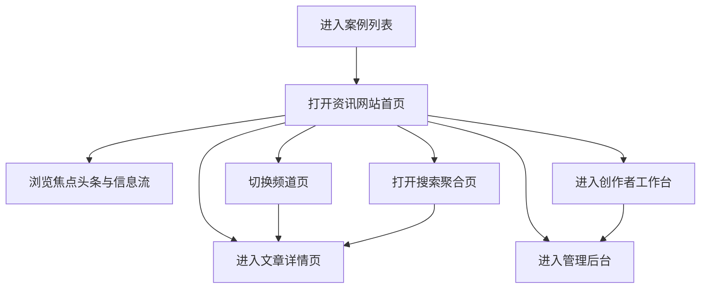

## 1. 产品概述
将“资讯内容类网站”案例从单页项目说明升级为一个可浏览的资讯类网站原型，直接以资讯网站首页作为案例落地页，并补充频道、热榜、搜索、创作者与后台等相关页面。
- 参考市面上综合门户、热点聚合平台和内容创作平台的典型结构，保留资讯站应有的首页信息密度、频道体系和内容分发逻辑。
- 目标是将案例从“文案展示”提升为“网站复刻型作品”，用于展示完整的信息架构、视觉风格与多页面体验。

## 2. 核心功能

### 2.1 功能模块
1. **资讯网站首页**：频道导航、热点焦点、信息流、热榜、专题、创作者区、视频资讯区。
2. **频道页**：按频道展示焦点内容、最新资讯、热门阅读、专题内容。
3. **文章详情页**：正文、作者信息、相关推荐、评论区、阅读模式。
4. **搜索聚合页**：热搜词、搜索结果、分类筛选、排序方式。
5. **创作者工作台页**：数据总览、内容管理、粉丝概况、收益卡片。
6. **管理后台页**：内容审核、运营配置、用户管理、广告投放、数据大盘。

### 2.2 页面详情
| 页面名称 | 模块名称 | 功能描述 |
|-----------|-------------|---------------------|
| 资讯首页 | 顶部频道导航 | 展示新闻、财经、科技、娱乐、汽车、体育等多频道入口 |
| 资讯首页 | 焦点头条 | 展示主焦点资讯、辅助头条和专题入口 |
| 资讯首页 | 热点榜单 | 展示实时热榜、24 小时热文榜、平台热议榜 |
| 资讯首页 | 个性化信息流 | 展示连续资讯卡片、图文混排、短内容卡片 |
| 资讯首页 | 专题与深读 | 展示专题策划、深度报道、数据图表内容 |
| 资讯首页 | 创作者专区 | 展示优质作者、专栏推荐、创作者入口 |
| 频道页 | 频道头部 | 展示频道标题、描述、子分类导航 |
| 频道页 | 频道内容流 | 展示频道焦点内容、最新内容和排行榜 |
| 文章详情页 | 正文内容 | 展示标题、摘要、作者、发布时间、正文与相关推荐 |
| 搜索页 | 搜索结果 | 展示关键词结果、热搜词、筛选器与排序 |
| 创作者工作台 | 数据看板 | 展示阅读、互动、粉丝、收益等核心指标 |
| 创作者工作台 | 内容管理 | 展示草稿、已发布内容、待审核内容和定时任务 |
| 管理后台 | 内容审核 | 展示待审核内容、风险标签、处理动作 |
| 管理后台 | 推荐配置 | 展示推荐位、权重策略、实验分组 |
| 管理后台 | 数据大盘 | 展示流量、用户、收入、留存等统计模块 |

## 3. 核心流程
用户从案例列表进入该案例后，直接抵达资讯网站首页，浏览频道导航、焦点新闻与热榜信息，并可继续进入频道页、文章详情页、搜索聚合页、创作者工作台和管理后台页，完整体验一个资讯平台从消费端到运营端的多页面结构。

## 4. 用户界面设计
### 4.1 设计风格
- 主色调：深蓝 `#081733`、墨蓝 `#12264d`
- 辅助色：青绿 `#18a787`、亮青 `#41d9b0`、警示橙 `#ff8b3d`
- 背景体系：浅灰白内容区搭配深色焦点区、榜单区与数据面板
- 按钮风格：圆角胶囊按钮、轻毛玻璃标签、悬停高亮
- 字体方案：标题使用高识别度杂志风衬线，正文采用清晰现代无衬线
- 布局风格：门户式密集布局、编辑式专题区、左右分栏与信息流组合
- 图标风格：线性图标 + 小型数据标签 + 数字强调
- 动效风格：频道切换过渡、卡片 hover、数字滚动、列表渐显

### 4.2 页面设计概览
| 页面名称 | 模块名称 | UI 元素 |
|-----------|-------------|-------------|
| 资讯首页 | 焦点首屏 | 大头条、专题图、侧边热榜、频道导航、推荐标签 |
| 资讯首页 | 信息流 | 图文资讯卡片、快讯卡片、短视频卡片、榜单条目 |
| 资讯首页 | 创作者专区 | 作者头像、专栏卡片、数据标签、入驻按钮 |
| 频道页 | 焦点区 | 频道主标题、分类切换、头条卡片、次级资讯列表 |
| 文章详情页 | 阅读区 | 标题、作者栏、摘要、正文、引用和相关推荐 |
| 搜索页 | 结果页 | 搜索框、关键词热搜、结果列表、筛选标签 |
| 创作者工作台 | 统计区 | 数据卡片、趋势列表、内容表格、收益面板 |
| 管理后台 | 后台总览 | 左侧菜单、指标卡、审核队列、推荐位列表 |

### 4.3 响应式设计
- 采用桌面优先设计，桌面端体现资讯站典型的多栏信息密度。
- 平板端将三栏或四栏内容压缩为双栏布局，保留关键榜单和信息流。
- 手机端聚焦焦点头条、热榜和内容流，频道导航转为横向滑动。
- 后台与工作台页面在移动端简化为垂直卡片流与横向数据滑动。
