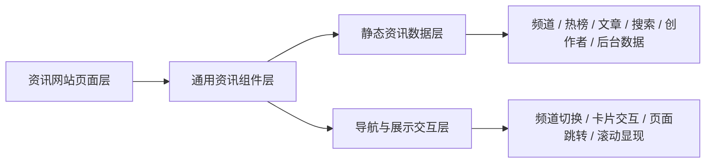
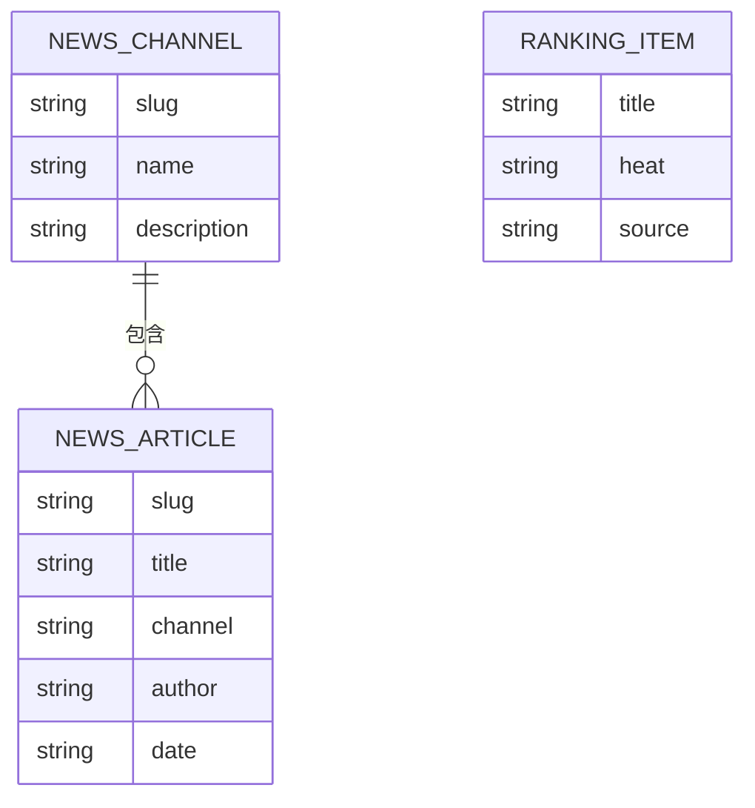

## 1. 架构设计


## 2. 技术描述
- 前端：Vue 3.5 + Vue Router 4 + Vite 5
- 样式：原生 CSS + CSS 变量 + 分页面模块化样式
- 数据：本地静态 JavaScript 模块维护资讯站内容、频道、榜单、作者、工作台和后台数据
- 交互：基于 Vue 计算属性、路由切换和少量滚动显现实现站点体验
- 部署：纯静态构建，可直接部署到 GitHub Pages 或其他静态托管平台

## 3. 路由定义
| 路由 | 用途 |
|-------|---------|
| /news/home.html | 资讯网站首页，作为案例主入口 |
| /news/channel/:slug.html | 频道页，展示某一频道的资讯内容 |
| /news/article/:slug.html | 资讯文章详情页 |
| /news/search.html | 搜索聚合页 |
| /news/creator.html | 创作者工作台页 |
| /news/admin.html | 内容平台管理后台页 |
| /cases.html | 案例列表页，案例卡片跳转到资讯网站首页 |

## 4. API 定义
项目不接入后端接口，所有内容由本地静态数据模块提供。

```ts
type NewsChannel = {
  slug: string
  name: string
  description: string
}

type NewsArticle = {
  slug: string
  title: string
  summary: string
  channel: string
  author: string
  date: string
  tags: string[]
  content: string[]
  featured?: boolean
}

type RankingItem = {
  title: string
  heat: string
  source: string
}
```

## 5. 数据模型
### 5.1 数据模型定义


### 5.2 数据说明
- `src/data/newsSite.js`：维护资讯网站首页、频道、热榜、文章、搜索、创作者与后台所需的全部静态数据
- `src/views/news/`：存放资讯网站相关页面
- `src/components/news/`：存放资讯网站复用组件
- `src/router/index.js`：注册资讯网站相关路由，并让案例入口跳转到资讯网站首页

## 6. 组件与页面拆分
- `src/views/news/home.vue`：资讯网站首页
- `src/views/news/channel.vue`：频道页
- `src/views/news/article.vue`：文章详情页
- `src/views/news/search.vue`：搜索聚合页
- `src/views/news/creator.vue`：创作者工作台页
- `src/views/news/admin.vue`：平台后台页
- `src/components/news/*`：头部导航、榜单、信息流、后台卡片等复用组件

## 7. 关键交互实现策略
- 首页作为案例落地页，保留完整资讯站入口与导航
- 频道页与文章页通过静态路由参数关联内容
- 搜索页通过本地数据模拟结果聚合与标签筛选
- 创作者和后台页面采用高仿真运营面板风格，强化案例真实感
- 所有页面保持统一视觉语言，但区分消费端和后台端的界面气质

## 8. 性能与可维护性
- 所有资讯站页面共用同一份数据源，方便后续继续扩展频道和内容
- 通过独立 `news` 文件夹隔离资讯案例与原博客页面，降低耦合
- 保持纯前端静态实现，便于展示和部署
- 组件化拆分首页模块、频道内容块和数据面板，避免单文件过大
